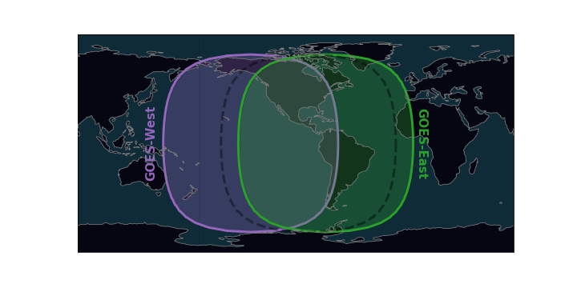

# NOAA_GOES
Download and read files from the NOAA GOES archive on AWS.

# Some Useful Links
- Rammb Slider: https://rammb-slider.cira.colostate.edu
- https://geonetcast.wordpress.com/2019/08/02/plot-0-5-km-goes-r-full-disk-regions/

# Field of View
GOES-West is centered over -137 W and GOES-East is centered over -75 W. When GOES was being tested, it was in a "central" position, outlined in the dashed black line.

