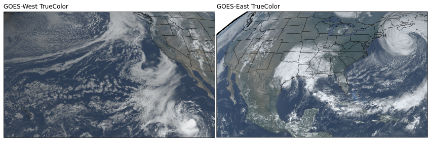
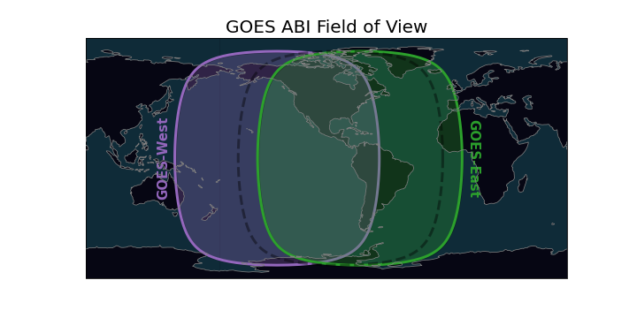

<div
  align="center"
>


# Download and display GOES-East and GOES-West data

<!-- Badges -->
[](https://pypi.python.org/pypi/goes2go/)

[](https://zenodo.org/badge/latestdoi/296737878)
<!--(Badges)-->

</div>

GOES-East and GOES-West satellite data are made available on Amazon Web Services through [NOAA's Big Data Program](https://www.noaa.gov/information-technology/big-data). **GOES-2-go** is a python package that makes it easy to find and download the files you want to your local computer with some additional helpers to look at and understand the data.

---

<br>

# 📔 [GOES-2-go Documentation](https://blaylockbk.github.io/goes2go/_build/html/)

<br>

---

# Capabilities

## Download Data
Download GOES ABI or GLM NetCDF files to your local computer. Files can also be read with xarray.

```python
from goes2go.data import goes_latest, goes_nearesttime

# Get latest data
G_ABI = goes_latest(satellite='G16', product='ABI')

# Get data for a specific time
G_GLM = goes_nearesttime('2021-01-01 12:00', satellite='G16', product='GLM')
```

## RGB Recipes
The `rgb` xarray accessor creates an RGB product for a GOES ABI multichannel xarray.Dataset. See the [demo](https://blaylockbk.github.io/goes2go/_build/html/user_guide/notebooks/DEMO_rgb_recipes.html#) for more examples of RGB products.

```python
from goes2go.data import goes_latest
import matplotlib.pyplot as plt
G = goes_latest()
ax = plt.subplot(projection=G.rgb.crs)
ax.imshow(G.rgb.TrueColor(), **G.rgb.imshow_kwargs)
ax.coastlines()
```




## Field of View

The `FOV` xarray accessor creates shapely.Polygon objects for the ABI and GLM field of view. See notebooks for [GLM](https://blaylockbk.github.io/goes2go/_build/html/user_guide/notebooks/field-of-view_GLM.html) and [ABI](https://blaylockbk.github.io/goes2go/_build/html/user_guide/notebooks/field-of-view_ABI.html) field of view.

```python
from goes2go.data import goes_latest
G = goes_latest()

# Get polygons of the full disk or ABI domain field of view.
G.FOV.full_disk
G.FOV.domain

# Get Cartopy coordinate reference system
G.FOV.crs
```

GOES-West is centered over -137 W and GOES-East is centered over -75 W. When GOES was being tested, it was in a "central" position, outlined in the dashed black line. Below is the ABI field of view for the full disk:


The GLM field of view is slightly smaller and limited by a bounding box. Below is the approximated GLM field of view:


>### Useful Links
>- [🙋🏻‍♂️ Brian's AWS GOES Web Downloader](https://home.chpc.utah.edu/~u0553130/Brian_Blaylock/cgi-bin/goes16_download.cgi)
>- [📔 GOES-R Series Data Book](https://www.goes-r.gov/downloads/resources/documents/GOES-RSeriesDataBook.pdf)
>- [🎠 Beginner's Guide](https://www.goes-r.gov/downloads/resources/documents/Beginners_Guide_to_GOES-R_Series_Data.pdf)
>- [🖥 Rammb Slider GOES Viewer](https://rammb-slider.cira.colostate.edu)
>- [💾 GOES on AWS](https://registry.opendata.aws/noaa-goes/)
>- [🐍 Unidata Plot GOES Data](https://unidata.github.io/python-training/gallery/mapping_goes16_truecolor/)
>- [🗺 Plotting tips form geonetcast blog](https://geonetcast.wordpress.com/2019/08/02/plot-0-5-km-goes-r-full-disk-regions/)
>- [🐍 `glmtools`](https://github.com/deeplycloudy/glmtools/)
>- [🐍 `satpy`](https://github.com/pytroll/satpy)


> ### What if I don't like the GOES-2-go package?
> As an alternative you can use [rclone](https://rclone.org/) to download GOES files from AWS. I quite like rclone. Here is a [short rclone tutorial](https://github.com/blaylockbk/pyBKB_v3/blob/master/rclone_howto.md).

---
---

I hope you find this makes GOES data easier to retrieve and display. Enjoy!

**Brian Blaylock**  
[🌐 Personal Webpage](http://home.chpc.utah.edu/~u0553130/Brian_Blaylock/home.html)  


P.S. If you like GOES-2-go, check out my [Herbie](https://github.com/blaylockbk/Herbie) package to download weather model data and [SynopticPy](https://github.com/blaylockbk/Herbie) to download mesonet data from the Synoptic API.