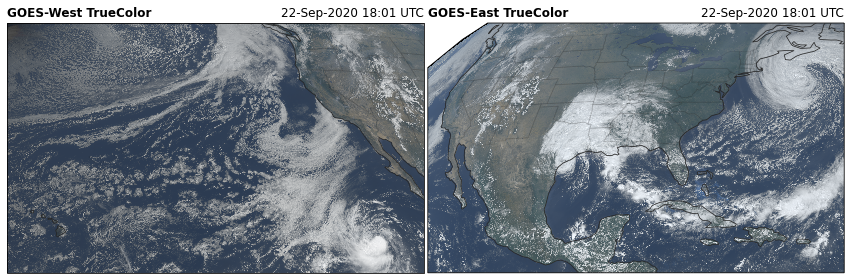
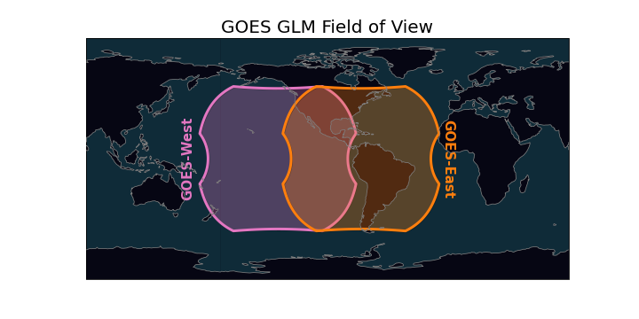

.. GOES-2-go documentation master file, created by
   sphinx-quickstart on Wed Jan  6 23:27:49 2021.
   You can adapt this file completely to your liking, but it should at least
   contain the root `toctree` directive.

.. image:: _static/goes2go_logo.png

=======================
GOES-2-Go Documentation
=======================

.. toctree::
   :maxdepth: 2
   :hidden:

   /user_guide/index
   /reference_guide/index

These python functions can help you download GOES-R series NetCDF files from the `Amazon Web Services <https://registry.opendata.aws/noaa-goes/>`_ archive.

Install
-------

Install goes2go in a conda environment. You may use this minimum `environment.yml
<https://github.com/blaylockbk/goes2go/blob/master/environment.yml>`_ file 
and create the environment with the following...

.. code:: bash

   # Create the environment
   conda env create -f environment.yml

   # Update the environment
   conda env update -f environment.yml

   # Activate the environment
   conda activate goes2go

Capabilities
------------

Download Data
^^^^^^^^^^^^^

The following example downloads GOES 16 ABI multichannel file on the fixed grid for the CONUS domain and reads it with xarray for the latest image and an image nearest a specific time.

.. code-block:: python

   from goes2go.data import goes_latest, goes_nearesttime

   # Get latest data
   G1 = goes_latest(satellite='G16', product='ABI')

   # Get data for a specific time
   G2 = goes_nearesttime(datetime(2020,10,1), satellite='G16', product='GLM')

RGB Recipes for ABI
^^^^^^^^^^^^^^^^^^^
Generate RGB arrays for different RGB products. Check out the following notebook for a demonstration:

- `📓 Example Notebook <https://github.com/blaylockbk/goes2go/blob/master/notebooks/DEMO_rgb_recipies.ipynb>`_

ABI TrueColor RGB image

Field of View
^^^^^^^^^^^^^

Advanced Baseline Imager (ABI)
""""""""""""""""""""""""""""""
GOES-West is centered over -137 W and GOES-East is centered over -75 W. When GOES was being tested, it was in a "central" position, outlined in the dashed black line. Below is the ABI field of view for the full disk:

- `📓 ABI field of view notebook <https://github.com/blaylockbk/goes2go/blob/master/notebooks/ABI_field-of-view.ipynb>`_

.. figure:: _static/ABI_field-of-view.png
   :class: img-fluid

   ABI full disk field of view

Geostationary Lightning Mapper (GLM)
""""""""""""""""""""""""""""""""""""
The GLM field of view is slightly smaller and limited by a bounding box. The field of view can be estimated.

- `📓 GLM field of view notebook <https://github.com/blaylockbk/goes2go/blob/master/notebooks/GLM_field-of-view.ipynb>`_
- `📓 More details on actual edges <https://github.com/blaylockbk/goes2go/blob/master/notebooks/GLM_field-of-view_Edges.ipynb>`_

   Approximate GLM field of view

Useful Links
------------
- `👨🏻‍💻 Brian's GitHub notebooks <https://github.com/blaylockbk/goes2go/tree/master/notebooks>`_ 
- `🎠 Beginner's Guide <https://www.goes-r.gov/downloads/resources/documents/Beginners_Guide_to_GOES-R_Series_Data.pdf>`_
- `📔 GOES-R Series Data Book <https://www.goes-r.gov/downloads/resources/documents/GOES-RSeriesDataBook.pdf>`_
- `💻 Rammb Slider GOES Viewer <https://rammb-slider.cira.colostate.edu/>`_
- `🐍 Unidata Plot GOES Data <https://unidata.github.io/python-training/gallery/mapping_goes16_truecolor/>`_
- `🗺 Plotting tips form geonetcast blog <https://geonetcast.wordpress.com/2019/08/02/plot-0-5-km-goes-r-full-disk-regions/>`_
- `🐍 glmtools <https://github.com/deeplycloudy/glmtools/>`_ For useful tools for GLM data.

💾 Data Access
^^^^^^^^^^^^
Access GOES data through NOAA's Big Data Project partners

- `Amazon Web Services <https://registry.opendata.aws/noaa-goes/>`_
   - `🌐 Brian's Interactive GOES Download Page <http://home.chpc.utah.edu/~u0553130/Brian_Blaylock/cgi-bin/goes16_download.cgi>`_
   - `🗃 AWS GOES-16 S3 Explorer <https://noaa-goes16.s3.amazonaws.com/index.html>`_
   - `🗃 AWS GOES-17 S3 Explorer <https://noaa-goes17.s3.amazonaws.com/index.html>`_
- `Microsoft Azure <https://azure.microsoft.com/en-us/services/open-datasets/catalog/goes-16/>`_ (Only GOES-16??)
- Google Cloud Platform `GOES-16 <https://console.cloud.google.com/marketplace/product/noaa-public/goes-16>`_ `GOES-17 <https://console.cloud.google.com/marketplace/product/noaa-public/goes-17>`_

Data Quality
^^^^^^^^^^^^^
- `⛑ GOES-17 ABI Data Quality (CIMSS) <http://cimss.ssec.wisc.edu/goes-r/abi-/band_statistics_imagery.html>`_

.. note::
   **This page is a work in progress.** I'm doing SynopticPy and GOES-2-go 
   with the PyData theme and HRRR-B with the ReadTheDocs theme.
